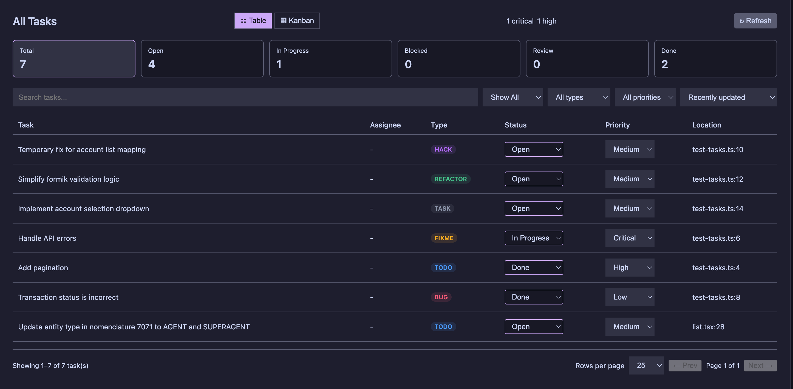
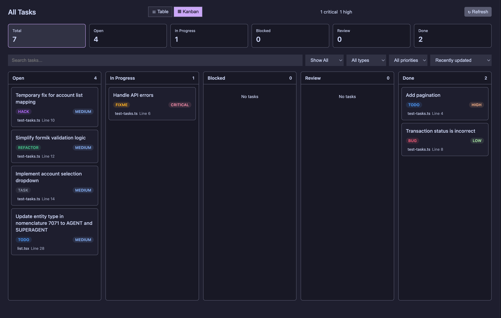

# CodeTasks

Turn TODO-style comments into a clean, lightweight task workspace inside VS Code.

> Keep code work visible, organized, and easy to revisit.

## Highlights

- Scan `TODO`, `FIXME`, `BUG`, `HACK`, `REFACTOR`, and `TASK` comments.
- View active work in a dedicated task workspace.
- Switch between table and Kanban layouts.
- Open rich task details for status, assignees, and source context.
- Archive finished work and restore it later when needed.
- Let task assignees be managed through the project's GitHub contributors.
- Customize task type colors to fit your team.

## Preview

### Table View

### Kanban View

## What You Get

### Tasks View

Your main workspace for active tasks.

### Archived Tasks

A separate home for completed or paused work.

### Task Details

A focused editor for updating task status, assignees, and notes.
Assignee suggestions can come from the project's GitHub contributors when enabled.

## Settings

CodeTasks stays lightweight by default, with a few useful options:

- `codetasks.autoRescanEnabled`
- `codetasks.autoRescanDebounceMs`
- `codetasks.codeLensEnabled`
- `codetasks.decorationsEnabled`
- `codetasks.scanExcludeGlobs`
- `codetasks.autoOpenWorkspaceOnStartup`
- `codetasks.sharedAssigneesEnabled`
- `codetasks.sharedAssigneesFile`
- `codetasks.githubAssigneesEnabled`
- `codetasks.typeColors`

## Requirements

- VS Code `^1.125.0`
- A workspace with supported task comments

## Quick Start

1. Open a project.
2. Click the CodeTasks icon in the Activity Bar.
3. Review active tasks in the workspace.
4. Open a task to update it, archive it, or assign it.

## Commands

CodeTasks includes commands for opening the workspace, opening archived tasks, refreshing the list, opening task details, changing status, and restoring archived items.

## Notes

- Shared assignees are optional.
- GitHub contributor suggestions are optional.
- The extension is designed to stay fast and low-overhead.

## Links

- Repository: https://github.com/Meadow-drafts/codetasks
- Issues: https://github.com/Meadow-drafts/codetasks/issues

## Release Notes

### 0.0.4

## Recent Updates

- Table pagination for active and archived task lists.
- Scrollable Kanban columns for large boards.
- Shorter location display in table views.
